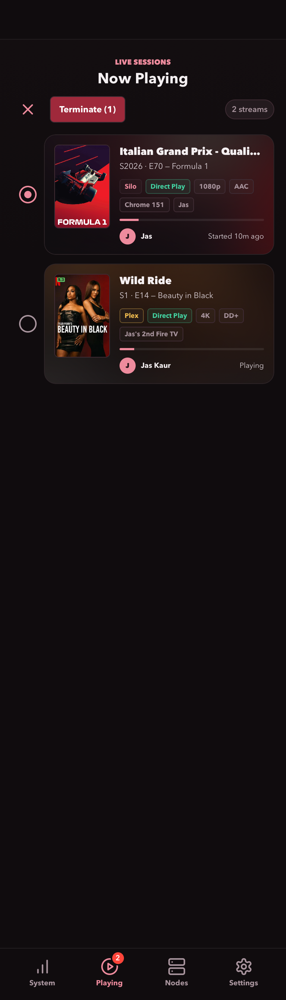
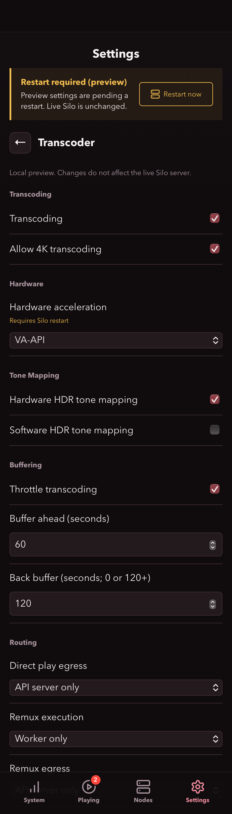

# Siloscope

A low-overhead, mobile-first wallboard for Silo CPU, memory, network bandwidth, disk usage, playback-node health, and active Silo and Plex playback sessions. A small Go server keeps API credentials out of the browser and retains five minutes of CPU, memory, download, and upload samples in memory so charts survive page reloads.

Includes recent playback activity, independent freshness indicators, free disk capacity, per-device display preferences, Silo transcoder controls, playback termination, and optional Web Push alerts for CPU, disk usage, playback, transcoding, and service outages/recovery.

## Compatible with

| Silo | Plex |
| --- | --- |
| <a href="https://github.com/Silo-Server/silo-server"></a> | <a href="https://www.plex.tv/"></a> |
| Resource and node monitoring, playback, and transcoder settings | Optional playback monitoring and session termination |

Logos identify compatible services; no affiliation or endorsement is implied. See [logo sources](docs/images/LOGOS.md).

## Screenshots

Mobile views captured using live server data and a read-only settings preview. Screenshots predate activity history, freshness/free-space indicators, and the latest grouped notification controls. No playback was terminated during capture.

| System | Playing |
| --- | --- |
|  |  |

| Nodes | Settings |
| --- | --- |
|  |  |

| Playback selection | Transcoder settings |
| --- | --- |
|  |  |

## Run with Docker Compose

1. Copy `.env.example` to `.env`.
2. Set `SILO_URL` to the Silo address reachable from the container.
3. Set `SILO_API_KEY` to an unscoped API key owned by an enabled Silo admin.
4. On the Linux Docker host, run `ip route show default`. Set `HOST_NETWORK_INTERFACE` in `.env` to the interface shown after `dev`, such as `eth0` or `enp0s6`.
5. To include Plex playback, set `PLEX_URL` to your Plex Media Server base URL (for example, `http://plex:32400`) and `PLEX_TOKEN` to its API token. Leave both blank for Silo-only playback.
6. To enable notifications, set `PUSH_CONTACT` in `.env` to your real contact URI, such as `mailto:admin@example.com` or `https://example.com/contact`. Leave it blank to disable push. This identifies the sender to the push provider; it is not a notification recipient.
7. Start the service with host bandwidth and process monitoring:

   ```sh
    docker compose -f compose.yaml -f compose.host-network.yaml -f compose.host-processes.yaml up -d
   ```

Use this same command after changing `.env`; a container restart alone does not apply environment changes. For image updates, pull the published image first, then recreate with the same files:

```sh
docker compose -f compose.yaml -f compose.host-network.yaml -f compose.host-processes.yaml pull
docker compose -f compose.yaml -f compose.host-network.yaml -f compose.host-processes.yaml up -d
```

The default local URL is `http://127.0.0.1:8091`. The health endpoint is `/healthz`. Host metrics require a Linux Docker host; process CPU usage becomes available after two samples, approximately 10 seconds after startup.

The Silo admin resource and session routes are not covered by the currently available scoped API-key permissions. Treat the key as a secret: keep `.env` out of source control and use it only in Siloscope's server-side configuration, never in browser settings.

## Run with Portainer

Create a stack using the following complete Compose definition. In Portainer's stack environment variables, set `SILO_URL`, `SILO_API_KEY`, and `HOST_NETWORK_INTERFACE` as described above. Set both `PLEX_URL` and `PLEX_TOKEN` to enable Plex, or leave both unset. Set `PUSH_CONTACT` to your real `mailto:` address or HTTPS contact URL to enable push. `MONITOR_BIND` and `MONITOR_PORT` default to `127.0.0.1` and `8091`.

```yaml
services:
   silo-monitor:
      image: ghcr.io/jasjeetsuri/silo-monitor:latest
      pull_policy: always
      restart: unless-stopped
      environment:
         SILO_URL: ${SILO_URL:?Set SILO_URL}
         SILO_API_KEY: ${SILO_API_KEY:?Set SILO_API_KEY}
         PLEX_URL: ${PLEX_URL:-}
         PLEX_TOKEN: ${PLEX_TOKEN:-}
         PUSH_CONTACT: ${PUSH_CONTACT:-}
         PUSH_DATA_DIR: /data/push
         ACTIVITY_DATA_DIR: /data/activity
         HOST_PROC_DIR: /host/proc
         HOST_NETWORK_STATS_DIR: /host/network
         LISTEN_ADDR: :8080
         GOMAXPROCS: "1"
         GOMEMLIMIT: 32MiB
      volumes:
         - notification-data:/data
         - /proc:/host/proc:ro
         - /sys/class/net/${HOST_NETWORK_INTERFACE:?Set HOST_NETWORK_INTERFACE}/statistics:/host/network:ro
      ports:
         - "${MONITOR_BIND:-127.0.0.1}:${MONITOR_PORT:-8091}:8080"
      read_only: true
      tmpfs:
         - /tmp:size=1m,mode=1777
      cap_drop:
         - ALL
      security_opt:
         - no-new-privileges:true
      pids_limit: 32
      mem_limit: 48m
      cpus: 0.10

volumes:
   notification-data:
```

Deploy the stack. For subsequent configuration changes, edit this same stack and its environment variables, then use **Update the stack** to apply them. All host-monitoring settings are included in this definition; no additional Compose files are needed for Portainer.

### Preserve existing data

The named volume at `/data` stores both playback history (`activity/history.json`) and push keys, subscriptions, rules, and alert state (`push/notifications.json`). Keep this mount writable even though the container root filesystem is read-only. Do not use `docker compose down -v` or delete the volume during updates. Back it up securely: it contains private viewing history and push credentials.

When moving or renaming an existing stack, reuse its actual volume name instead of creating an empty one. Find it with `docker volume ls`. For example, to retain an existing volume named `silo-performance_notification-data`, replace the top-level volume definition above with:

```yaml
volumes:
   notification-data:
      external: true
      name: silo-performance_notification-data
```

Keep the service mount as `notification-data:/data`. The external volume must already exist; substitute your own existing name. For a new installation, use the original managed-volume definition. History remains enabled when `PUSH_CONTACT` is blank. Preserve `PUSH_CONTACT`, `PUSH_DATA_DIR`, and `ACTIVITY_DATA_DIR` when consolidating Compose overrides into a single stack.

## Configuration

| Variable | Default | Purpose |
| --- | --- | --- |
| `SILO_URL` | required | Silo base URL reachable by the monitor container |
| `SILO_API_KEY` | required | Silo admin API key |
| `PLEX_URL` | unset | Optional Plex Media Server base URL, usually `http://plex:32400` |
| `PLEX_TOKEN` | unset | Plex API token (`X-Plex-Token`), required when `PLEX_URL` is set |
| `LISTEN_ADDR` | `:8080` | Address used by the Go server |
| `MONITOR_BIND` | `127.0.0.1` | Host address published by Compose |
| `MONITOR_PORT` | `8091` | Host port published by Compose |
| `HOST_NETWORK_INTERFACE` | `eth0` | Host NIC used by the optional bandwidth override |
| `HOST_NETWORK_STATS_DIR` | unset | Directory containing host NIC `rx_bytes` and `tx_bytes` counters |
| `HOST_PROC_DIR` | unset | Read-only host `/proc` mount for the top CPU process list |
| `PUSH_CONTACT` | unset | Enables Web Push when set to a real `mailto:` address or HTTPS contact URL |
| `PUSH_DATA_DIR` | `/data/push` in Compose | Writable persistent directory for signing keys, subscriptions, rules, and alert state; required when push is enabled |
| `ACTIVITY_DATA_DIR` | `/data/activity` in Docker/Compose; unset for standalone binaries | Writable persistent playback-history directory; independent of push configuration |

The server samples resources every 5 seconds into bounded in-memory charts and Silo/configured Plex sessions every 10 seconds into playback history, persisted when `ACTIVITY_DATA_DIR` is set, even without notification subscriptions or an open browser. The browser polls resources every 5 seconds and sessions, nodes, and activity every 15 seconds while visible. Resource responses are cached for 4 seconds and session responses for 10 seconds. Browser polling pauses when Mobile Safari backgrounds the tab; server history collection continues.

The image is published for AMD64 and ARM64 at `ghcr.io/jasjeetsuri/silo-monitor:latest`.

Both installation methods above mount the selected host interface's byte counters and host `/proc` read-only. Network graphs report total host ingress and egress, and the process list reports the three highest CPU consumers as a percentage of total host CPU capacity.

## Push notifications

**Settings > Notifications** groups controls under **CPU Alerts**, **Disk Alerts**, **Playback Alerts**, and **Service Alerts**. Enable/Disable notifications and Send test remain at the top. Sliders show their current values and are disabled when their alert is off; titles and usernames are an opt-in setting under Playback Alerts.

**Service Alerts > Service outages and recovery** is off by default. Silo and configured Plex session API failures (including authentication failures or invalid responses) trigger one alert after at least 60 seconds of consecutive failed checks. The first successful check after an alerted outage queues recovery confirmation. Enabled nodes are checked through Silo's node API every 10 seconds; only explicit unhealthy results with a health-check timestamp no older than 45 seconds count. Missing/stale checks or node API failures are unknown, not proof of individual node failures. Disabled/removed nodes are excluded without recovery notifications. Node names appear in service alerts.

Outage notification state survives restarts, but sustained timers restart after downtime or monitoring gaps over 35 seconds. Turning the service rule off/on re-arms it. Silo and Plex checks run independently; an unavailable Silo API does not generate a cascade of node alerts. These are checks from Siloscope's network location, not an external uptime guarantee. Siloscope cannot notify while it is itself down, and losing outbound connectivity can prevent delivery.

Disk alerts are opt-in under **Settings > Notifications > Disk Alerts > High disk usage**. The threshold slider defaults to 90% (range 75-100%) and applies to each disk shown by Silo. An alert is sent on the first fresh reading at or above the threshold, including when enabled while a disk is already full enough. Each disk alerts once until usage falls at least five percentage points below the threshold, then can alert again. This state survives restarts; changing the disk rule or threshold re-arms it. Missing, unavailable, or stale disk readings do not trigger or re-arm alerts. Disk checks reuse the existing background resource samples and work with the app closed, without extra polling.

Once notifications are enabled, preferences autosave on this device: toggles save immediately, and sliders save on release or keyboard adjustment. CPU sliders allow 70-100% usage, 5-15 minutes sustained, and a 10-60 minute cooldown. Values are displayed while dragging. Back navigation waits for an in-progress save; failed saves keep the editor open, restore the last confirmed values, and show an error. Existing API rules remain supported; saved values outside the slider ranges are clamped in the editor and applied on the next save.

Push is optional and disabled until `PUSH_CONTACT` is set. Set it to your real contact address, for example `mailto:admin@your-domain.example`, and recreate the container with the updated Compose definition. A named volume at `/data` preserves the automatically generated VAPID signing keys and device subscriptions. With a bind mount instead, give UID 65532 write access to the directory. Do not expose this directory through the web server or commit its contents. Back it up securely; losing the keys requires devices to re-enable notifications.

If **Send test** does not arrive, check the container logs. The UI's **Test notification queued** message confirms only local queueing; `push test notification accepted by service (HTTP 201)` confirms provider acceptance, not display on the device. HTTP 403 means the provider rejected the request: check the contact URI and use the latest image. Older versions incorrectly doubled the `mailto:` prefix for email contacts; updating fixes this without replacing keys or subscriptions. Keep exactly one `mailto:` prefix in `PUSH_CONTACT`. For an accepted message that does not appear, check notification permission, Focus modes, and the installed Home Screen app on iOS. Wait at least one minute between test requests. Do not delete the data volume to troubleshoot delivery.

On iOS 16.4 or later, add the HTTPS site to the Home Screen, open that installed app, then choose **Settings > Notifications > Enable notifications** and grant permission. On supported desktop browsers, the same setting works over HTTPS (localhost also works for development). Use **Send test** to check delivery. Apple, Google/FCM, and Mozilla push endpoints are supported; outbound HTTPS access to those services is required. An authenticated reverse proxy is still required. Subscriptions must only be created by trusted administrators; same-origin checks are not authentication. Push can continue after a browser login expires until the device subscription is disabled or removed.

Preferences are per device. CPU alerts default to 85% sustained for five minutes, a 30-minute repeat cooldown, and a recovery notification once CPU falls at least five percentage points below the threshold. CPU uses existing cached samples without another host scan. Missing or stale samples reset the sustained timer. Playback/transcode alerts are off by default and reuse the always-on history collector's ten-second polls and browser-request caches. They continue with the app closed, without additional session polls.

The first successful session poll after startup, a long polling gap, or a preference change establishes a baseline without sending alerts for existing streams. Subsequent new sessions and transitions to transcoding notify once per observed transition. A new transcoding session can produce both notifications when both rules are enabled. Events of each type in one poll are grouped per source. Titles and usernames are hidden by default and can be enabled per device. CPU cooldown and subscription state survive restarts; the sustained CPU timer restarts because CPU activity during downtime is unknown.

Delivery is best-effort: Focus modes, connectivity, browser restrictions, or push-service errors may delay or prevent alerts. Sessions shorter than the polling interval can be missed. A bounded in-memory queue and one delivery worker limit resource usage; queued notifications are not retried or replayed after a restart. A full queue drops playback events; sustained service conditions can queue again at a later check. Expired subscriptions are removed after HTTP 404/410 responses. There is a limit of 32 devices, and test notifications are limited to one per device per minute. The service worker handles push/click events only and does not cache pages, credentials, or API responses. No new process scans are added; service alerts add background node-API polling when enabled.

## Activity and freshness

The **history icon at the top right of Playing** opens a separate **History** screen. Its compact list shows poster artwork when available, the film or series title, episode details, and the user with a relative time. Select an item to expand its source, playback method, observed duration, and start/stop timestamps. The back arrow returns to Playing and restores its scroll position; the Playing tab stays selected while viewing history. Settings subpages use the same borderless back-arrow style. Tapping History navigation does not leave a focus outline; keyboard navigation retains visible focus indicators on controls.

History retains up to 200 session records last seen within 30 days, across Silo and Plex, with 20 records shown at a time. Records are removed when older than 30 days or displaced by the 200-entry cap, whichever comes first. Playback method is the latest observed value (Direct play, Remux, Transcoding, or Unknown). Sessions already present at startup are labelled **First seen**, not assigned an invented start time. Active records are discarded after more than 35 seconds without an observation; failed requests never create stop or monitoring-gap entries. Completed records are unaffected by polling interruptions. Duration is elapsed observed time, including pauses, not watch time or media position. Short sessions between polls can be missed.

Activity is saved after each ten-second collection cycle when `ACTIVITY_DATA_DIR` is set. Docker/Compose defaults the directory to `/data/activity`, with records in `/data/activity/history.json`; mount a persistent volume at `/data` to retain history across container replacements. Both Compose examples above provide this mount, and history storage works independently of push notifications. For a standalone binary, set `ACTIVITY_DATA_DIR` to a private writable directory; leaving it unset uses memory only and logs a warning.

History files are replaced atomically with mode `0600` inside a directory created with mode `0700`. Startup rejects invalid or unwritable storage instead of silently clearing it. Retention is 30 days and 200 records. Startup removes legacy monitoring-gap entries and unfinished sessions from storage, retaining completed records; currently playing sessions get a fresh observed baseline. The latest unfinished collection cycle can be lost on an abrupt shutdown. Titles, usernames, and artwork references are retained on disk independently of the push-details preference. Protect the storage directory and `/api/activity` with the same care as the rest of the administrator dashboard. History already lost before persistence was enabled cannot be recovered.

System, Silo, Plex, and Nodes show warnings only when data is stale, unavailable, or still loading; healthy data has no update label. System age uses Silo's actual sample timestamp; session/node-list ages measure the last successful response, which can include up to 10 seconds of server caching. Resource data older than 15 seconds, session/node responses older than 35 seconds, failed requests, and offline connectivity are flagged stale. Browser requests time out after 10 seconds. Node health checks older than 45 seconds are shown as Unknown rather than Healthy.

Disk usage displays a usage bar with a large **free GiB** readout on the right, plus percentage and used/total capacity. Free space is derived from Silo's process-usable capacity minus used space, not nameplate capacity. Invalid metrics are omitted and per-disk stale readings are labelled. The current Silo resource API does not expose rclone cache size, so that optional metric is not displayed; Siloscope does not scan or modify the cache directory.

## Plex playback

To include Plex in the existing Playing screen, set both `PLEX_URL` and `PLEX_TOKEN` in `.env`, then recreate the monitor with your usual Compose files. The URL must be reachable from the monitor container; `localhost` refers to that container, not the Plex host. Use the Plex server URL, not `app.plex.tv` or the `/web` page. Prefer HTTPS when connecting over an untrusted network.

`PLEX_TOKEN` is your Plex API token, sent as the `X-Plex-Token` header. See [Plex's token instructions](https://support.plex.tv/articles/204059436-finding-an-authentication-token-x-plex-token/) to obtain a server-owner token. Keep it in server-side configuration, never in the URL or browser settings.

The monitor reads `/status/sessions` every 10 seconds for activity history, with a shared 10-second server cache. The browser refreshes every 15 seconds while visible. Plex movies, episodes, and music appear beside Silo streams, labeled by source, with users, clients, playback method, progress, and paused state. Posters are proxied through the monitor so the token stays on the backend. Plex does not provide a reliable session start time here, so its cards show playback state instead.

The Playing badge counts sessions from both sources. Plex sessions do not affect Silo node routing or job counts. If either playback source fails, the other remains visible with an outage notice; unavailable sessions are removed until the source recovers. Leave both variables blank to disable Plex. Protect the monitor behind your existing authenticated proxy because it exposes playback activity and posters.

## Terminate playback

In **Playing**, press the cross icon (**Select sessions to terminate**) to reveal selection circles. Select one or more Silo or Plex sessions, then press **Terminate (N)**. The request is sent immediately, with **no confirmation dialog**. Press the cross again or Escape to leave selection mode without stopping anything.

Each selected session receives its own termination request. Cards show pending, requested, or failed status independently; failed selections remain available for retry. Accepted requests are not proof that playback has ended: the card remains until the session disappears from a subsequent refresh. If a request times out or cannot be confirmed, check playback before retrying. Sessions without a usable termination identifier cannot be selected.

Silo termination uses its admin session-termination API; Plex uses its session-termination endpoint and the configured server-owner token. Server support and sufficient permissions are required. Credentials stay on the backend. Anyone with access to Siloscope can terminate playback, so restrict dashboard access to administrators through an authenticated reverse proxy.

## Transcoder settings

Settings > Transcoder edits Silo's server-wide transcoding configuration: transcoding and 4K permissions, hardware acceleration, hardware/software HDR tone mapping, throttling and buffers, and playback execution/egress routing. Chapter settings, GPU device selection, and FFmpeg/transcode directory paths are excluded.

Controls are grouped under **Transcoding**, **Hardware**, **Tone Mapping**, **Buffering**, and **Routing**, with the same headings and dividers used across Settings.

| Control | Available values |
| --- | --- |
| Transcoding | Enabled or disabled |
| Allow 4K transcoding | Enabled or disabled |
| Hardware acceleration | Auto, Intel Quick Sync (QSV), VA-API, NVIDIA NVENC, VideoToolbox (macOS), or Software |
| Hardware HDR tone mapping | Enabled or disabled |
| Software HDR tone mapping | Enabled or disabled |
| Throttle transcoding | Enabled or disabled |
| Buffer ahead | Seconds, 0 or greater |
| Back buffer | Seconds, either 0 or at least 120 |
| Direct play, remux, and video transcode egress | Prefer proxy, Proxy only, Prefer API server, or API server only; configured separately for each playback method |
| Remux and video transcode execution | Prefer worker, Worker only, Prefer API server, or API server only; configured separately for each playback method |

Execution controls where processing runs; egress controls where playback is delivered from. Hardware modes depend on the capabilities of the Silo host or execution node. Silo validates changes and reports unsupported values.

Toggles and dropdowns save automatically on change. Numeric fields save after a short typing pause or when committed, provided the value is valid. Rejected changes restore the previous value; unconfirmed saves require reloading settings before further edits. Display-preference resets never change Silo configuration. Restart notices come from Silo: saving is immediate, but settings marked as requiring a restart do not take effect until Silo is restarted. Saving never automatically restarts it. Missing fields are disabled rather than assigned guessed defaults. The Silo version must support the effective-settings, restart-keys, and batch settings APIs.

This makes the dashboard an administrative interface, not just a read-only wallboard. Anyone with access can change these server settings using its configured admin key. Keep the service bound to localhost or a trusted private network and require administrator authentication at your reverse proxy before exposing it. Same-origin checks prevent cross-site browser writes; they are not a substitute for authentication. Credentials remain on the backend, and only the listed settings can be read or written through this endpoint.

The top of every Settings view shows a banner when Silo reports a pending restart, including changes made outside Siloscope. Status refreshes every 15 seconds while Settings is visible and clears once Silo reports no pending restart. Known warnings remain visible during status outages. Individual controls that require a restart are labelled independently of the pending banner. Siloscope does not restart the server automatically.

The banner's **Restart now** button requests a graceful Silo restart after confirmation. Active playback may be interrupted. The button stays disabled while waiting for a new server start time; failed or unconfirmed requests show status feedback rather than silently retrying. Access to the dashboard therefore also grants the ability to restart Silo through its configured admin credentials.

## Display preferences

Playback cards include video resolution (4K, 1080p, 720p, or 480p), audio codec labels such as DTS, DTS-HD MA, DD, DD+, and TrueHD, and Silo's confirmed SW/HW tone-mapping mode. Source and output are shown together when they differ. Missing details are omitted; tone mapping is never inferred from hardware video acceleration. Plex audio profiles come from the selected audio stream when available.

The bottom-right Settings tab has separate System, Playing, and Nodes menus, organized into labelled groups:

| Page | Groups |
| --- | --- |
| System | Layout, Graph Settings, Page Indicators, Disk Usage, CPU, Bandwidth, Memory |
| Playing | Page Indicators, Session Appearance, Media Details, Playback Details |
| Nodes | Page Indicators, Node Identity, Health & Activity, Resources |

Toggle whole panels or cards and individual details, including the CPU process list, session metadata, node statistics, and tab badges. Dependent controls are indented and disabled when their parent is hidden, without losing their saved selections. System's Layout group controls panel order; Graph Settings controls height and time window. Hidden content continues refreshing.

Display preferences save immediately in this browser on this device, not on the server. Reset tab restores one view; Reset all restores every display preference. Neither reset changes notification rules or Silo's transcoder settings. When browser storage is unavailable, changes apply for the current page only.

In **Settings > System > Graph Settings**, Time window selects 2, 3, 4, or 5 minutes for the CPU, memory, and network graphs. The default is 5 minutes. The full five-minute history is retained when selecting a shorter window, and graphs with fewer samples show the available history until the selected duration is filled. Height ranges from 100 to 220 pixels, with a default of 140 pixels.

Each main tab remembers its scroll position while switching views. Content scrolls independently of the bottom navigation, including in the iPhone Home Screen app.

## Build locally

```sh
docker build -t silo-monitor:local .
```
