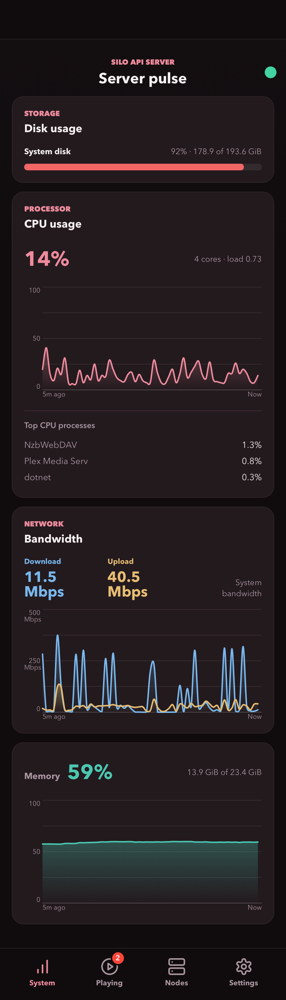
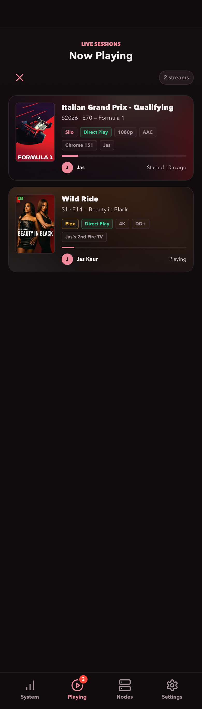
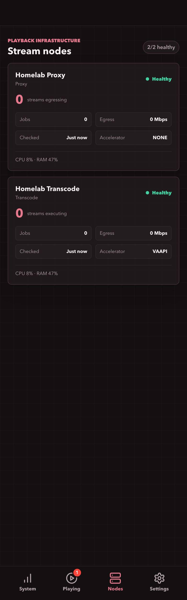
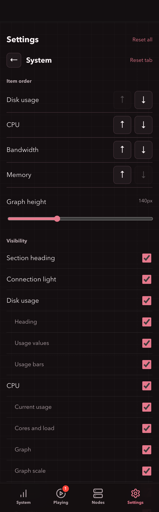

# Siloscope

A low-overhead, mobile-first wallboard for Silo CPU, memory, network bandwidth, disk usage, playback-node health, and active Silo and Plex playback sessions. A small Go server keeps API credentials out of the browser and retains five minutes of CPU, memory, download, and upload samples in memory so charts survive page reloads.

## Screenshots

Mobile views of a live Silo server.

| System | Playing |
| --- | --- |
|  |  |

| Nodes | Settings |
| --- | --- |
|  |  |

## Run with Docker Compose

1. Copy `.env.example` to `.env`.
2. Set `SILO_URL` to the Silo address reachable from the container.
3. Set `SILO_API_KEY` to an unscoped API key owned by an enabled Silo admin.
4. On the Linux Docker host, run `ip route show default`. Set `HOST_NETWORK_INTERFACE` in `.env` to the interface shown after `dev`, such as `eth0` or `enp0s6`.
5. To include Plex playback, set `PLEX_URL` to your Plex Media Server base URL (for example, `http://plex:32400`) and `PLEX_TOKEN` to its API token. Leave both blank for Silo-only playback.
6. Start the service with host bandwidth and process monitoring:

   ```sh
    docker compose -f compose.yaml -f compose.host-network.yaml -f compose.host-processes.yaml up -d
   ```

Use this same command for updates and after changing `.env`. It recreates the service when needed with all monitoring settings applied.

The default local URL is `http://127.0.0.1:8091`. The health endpoint is `/healthz`. Host metrics require a Linux Docker host; process CPU usage becomes available after two samples, approximately 10 seconds after startup.

The Silo admin resource and session routes are not covered by the currently available scoped API-key permissions. Treat the key as a secret: keep `.env` out of source control and do not put the key in Pangolin or browser configuration.

## Run with Portainer

Create a stack using the following complete Compose definition. In Portainer's stack environment variables, set `SILO_URL`, `SILO_API_KEY`, and `HOST_NETWORK_INTERFACE` as described above. Set both `PLEX_URL` and `PLEX_TOKEN` to enable Plex, or leave both unset. `MONITOR_BIND` and `MONITOR_PORT` default to `127.0.0.1` and `8091`.

```yaml
services:
   silo-monitor:
      image: ghcr.io/jasjeetsuri/silo-monitor:latest
      pull_policy: always
      restart: unless-stopped
      environment:
         SILO_URL: ${SILO_URL:?Set SILO_URL}
         SILO_API_KEY: ${SILO_API_KEY:?Set SILO_API_KEY}
         PLEX_URL: ${PLEX_URL:-}
         PLEX_TOKEN: ${PLEX_TOKEN:-}
         HOST_PROC_DIR: /host/proc
         HOST_NETWORK_STATS_DIR: /host/network
         LISTEN_ADDR: :8080
         GOMAXPROCS: "1"
         GOMEMLIMIT: 32MiB
      volumes:
         - /proc:/host/proc:ro
         - /sys/class/net/${HOST_NETWORK_INTERFACE:?Set HOST_NETWORK_INTERFACE}/statistics:/host/network:ro
      ports:
         - "${MONITOR_BIND:-127.0.0.1}:${MONITOR_PORT:-8091}:8080"
      read_only: true
      tmpfs:
         - /tmp:size=1m,mode=1777
      cap_drop:
         - ALL
      security_opt:
         - no-new-privileges:true
      pids_limit: 32
      mem_limit: 48m
      cpus: 0.10
```

Deploy the stack. For subsequent configuration changes, edit this same stack and its environment variables, then use **Update the stack** to apply them. All host-monitoring settings are included in this definition; no additional Compose files are needed for Portainer.

## Pangolin

When Newt runs on the Docker host, create a Pangolin HTTP resource targeting `http://127.0.0.1:8091`.

When Newt runs in Docker, attach both containers to the same Docker network, remove the public `ports` mapping if it is not needed, and target `http://silo-monitor:8080` from Newt. Pangolin should terminate HTTPS for the public hostname.

## Configuration

| Variable | Default | Purpose |
| --- | --- | --- |
| `SILO_URL` | required | Silo base URL reachable by the monitor container |
| `SILO_API_KEY` | required | Silo admin API key |
| `PLEX_URL` | unset | Optional Plex Media Server base URL, usually `http://plex:32400` |
| `PLEX_TOKEN` | unset | Plex API token (`X-Plex-Token`), required when `PLEX_URL` is set |
| `LISTEN_ADDR` | `:8080` | Address used by the Go server |
| `MONITOR_BIND` | `127.0.0.1` | Host address published by Compose |
| `MONITOR_PORT` | `8091` | Host port published by Compose |
| `HOST_NETWORK_INTERFACE` | `eth0` | Host NIC used by the optional bandwidth override |
| `HOST_NETWORK_STATS_DIR` | unset | Directory containing host NIC `rx_bytes` and `tx_bytes` counters |
| `HOST_PROC_DIR` | unset | Read-only host `/proc` mount for the top CPU process list |

The server samples resources every 5 seconds into a bounded in-memory history. The browser polls the current resource sample every 5 seconds and sessions every 15 seconds while visible. Resource responses are cached for 4 seconds and session responses for 10 seconds. Browser polling pauses when Mobile Safari backgrounds the tab; server history collection continues.

The image is published for AMD64 and ARM64 at `ghcr.io/jasjeetsuri/silo-monitor:latest`.

Both installation methods above mount the selected host interface's byte counters and host `/proc` read-only. Network graphs report total host ingress and egress, and the process list reports the three highest CPU consumers as a percentage of total host CPU capacity.

## Plex playback

To include Plex in the existing Playing screen, set both `PLEX_URL` and `PLEX_TOKEN` in `.env`, then recreate the monitor with your usual Compose files. The URL must be reachable from the monitor container; `localhost` refers to that container, not the Plex host. Use the Plex server URL, not `app.plex.tv` or the `/web` page. Prefer HTTPS when connecting over an untrusted network.

`PLEX_TOKEN` is your Plex API token, sent as the `X-Plex-Token` header. See [Plex's token instructions](https://support.plex.tv/articles/204059436-finding-an-authentication-token-x-plex-token/) to obtain a server-owner token. Keep it in server-side configuration, never in the URL or browser settings.

The monitor reads `/status/sessions` every 15 seconds while the page is visible, with a 10-second server cache. Plex movies, episodes, and music appear beside Silo streams, labeled by source, with users, clients, playback method, progress, and paused state. Posters are proxied through the monitor so the token stays on the backend. Plex does not provide a reliable session start time here, so its cards show playback state instead.

The Playing badge counts sessions from both sources. Plex sessions do not affect Silo node routing or job counts. If either playback source fails, the other remains visible with an outage notice; unavailable sessions are removed until the source recovers. Leave both variables blank to disable Plex. Protect the monitor behind your existing authenticated proxy because it exposes playback activity and posters.

## Transcoder settings

Settings > Transcoder edits Silo's server-wide transcoding configuration: transcoding and 4K permissions, hardware acceleration, hardware/software HDR tone mapping, throttling and buffers, and playback execution/egress routing. Chapter settings, GPU device selection, and FFmpeg/transcode directory paths are excluded.

Toggles and dropdowns save automatically on change. Numeric fields save after a short typing pause or when committed, provided the value is valid. Rejected changes restore the previous value; unconfirmed saves require reloading settings before further edits. Display-preference resets never change Silo configuration. Restart notices come from Silo: saving is immediate, but settings marked as requiring a restart do not take effect until Silo is restarted. Saving never automatically restarts it. Missing fields are disabled rather than assigned guessed defaults. The Silo version must support the effective-settings, restart-keys, and batch settings APIs.

This makes the dashboard an administrative interface, not just a read-only wallboard. Anyone with access can change these server settings using its configured admin key. Keep the service bound to localhost or a trusted private network and require administrator authentication at your reverse proxy before exposing it. Same-origin checks prevent cross-site browser writes; they are not a substitute for authentication. Credentials remain on the backend, and only the listed settings can be read or written through this endpoint.

The top of every Settings view shows a banner when Silo reports a pending restart, including changes made outside Siloscope. Status refreshes every 15 seconds while Settings is visible and clears once Silo reports no pending restart. Known warnings remain visible during status outages. Individual controls that require a restart are labelled independently of the pending banner. Siloscope does not restart the server automatically.

The banner's **Restart now** button requests a graceful Silo restart after confirmation. Active playback may be interrupted. The button stays disabled while waiting for a new server start time; failed or unconfirmed requests show status feedback rather than silently retrying. Access to the dashboard therefore also grants the ability to restart Silo through its configured admin credentials.

## Display preferences

Playback cards include video resolution (4K, 1080p, 720p, or 480p), audio codec labels such as DTS, DTS-HD MA, DD, DD+, and TrueHD, and Silo's confirmed SW/HW tone-mapping mode. Source and output are shown together when they differ. Missing details are omitted; tone mapping is never inferred from hardware video acceleration. Plex audio profiles come from the selected audio stream when available.

The bottom-right Settings tab has separate System, Playing, and Nodes menus. Toggle sections and individual details, including the CPU process list, session metadata, node statistics, and tab badges. System also supports item reordering and graph height adjustment. Hidden content continues refreshing.

Preferences are saved in this browser on this device, not on the server. Reset tab restores one view; Reset all restores every display preference. When browser storage is unavailable, changes apply for the current page only.

In Settings > System, Graph time window selects 2, 3, 4, or 5 minutes for the CPU, memory, and network graphs. The default is 5 minutes. The full five-minute history is retained when selecting a shorter window, and graphs with fewer samples show the available history until the selected duration is filled.

## Build locally

```sh
docker build -t silo-monitor:local .
```
